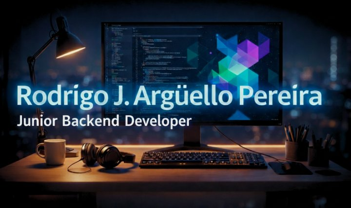

<p align="center">
  
</p>

<h1 align="center">Hi 👋, I'm Rodrigo José Argüello Pereira</h1>
<h3 align="center">Junior Backend Developer from Paraguay 🇵🇾</h3>

<p align="center">
  
</p>

---

### 🧠 About Me

- 💻 Passionate about backend development, databases, and building reliable server-side systems.
- 🔭 Currently enrolled in **Penguin Academy CodePro Bootcamp**.
- 🌱 Deepening my knowledge in **Java & Spring Boot** for enterprise-grade backend development.
- 🚀 Eager to take on new professional challenges and grow as a developer.
- 🎯 Goal: To become a professional backend developer and contribute to innovative projects.

---

### 🛠 Tech Stack

**Languages**


**Frameworks & Technologies**


**Databases**


**Tools & Version Control**


---

### 🚀 Currently Exploring
```java
@RestController
public class RodrigoController {

    @GetMapping("/about-me")
    public String aboutMe() {
        return "Learning Java + Spring Boot to build scalable backend systems 🚀";
    }
}
```

---

### 🌍 Languages

- 🏠 Spanish: Native
- 🗣️ English: Upper-Intermediate (B2) — Currently studying at **The Anglo, Asunción**

---

### 📊 GitHub Stats

<p align="center">
  
  &nbsp;
  
</p>

<p align="center">
  
</p>

---

### 🤝 Connect with me

<p align="left">
  <a href="https://www.linkedin.com/in/rodrigoarguello111" target="_blank">
    
  </a>
</p> 
